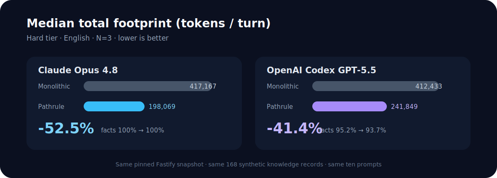

<div align="center">

# Pathrule Benchmarks

### Path-scoped knowledge delivery vs. a monolithic instruction dump

[](METHODOLOGY.md)
[](#results)
[](LICENSE)

Same repository. Same synthetic knowledge. Same prompts. Different delivery.



</div>

## The question

Coding agents need project knowledge: decisions, rules, procedures, and local
conventions. The simplest delivery mechanism is one large root instruction file.
Pathrule instead compiles the same knowledge into native, path-scoped instruction
files so the client loads the relevant project slice.

This benchmark asks:

> What happens to answer quality, token usage, and duration when identical
> project knowledge is delivered as one monolithic file or as native
> path-scoped instructions?

This first public snapshot is deliberately narrow: **hard tier, English,
three runs per cell**. Testing is ongoing. New tiers, languages, models, and
completed cells will be added without rewriting or hiding this snapshot.

## Results

All four published cells completed `3/3` runs. Values below are medians across
the three full ten-prompt sessions.

### Claude Opus 4.8

| Metric | Monolithic | Pathrule | Change |
| --- | ---: | ---: | ---: |
| Fact accuracy | 100.0% | 100.0% | 0.0 pp |
| Action accuracy | 100.0% | 100.0% | 0.0 pp |
| Non-cached tokens | 30,918 | 16,084 | **-48.0%** |
| Total token footprint | 417,167 | 198,069 | **-52.5%** |
| Duration | 69.2 s | 69.4 s | +0.2% |

Pathrule preserved every measured fact and required action while cutting median
non-cached tokens by 48.0%. Duration was effectively flat.

### OpenAI Codex GPT-5.5

| Metric | Monolithic | Pathrule | Change |
| --- | ---: | ---: | ---: |
| Fact accuracy | 95.2% | 93.7% | **-1.6 pp** |
| Action accuracy | 50.0% | 83.3% | **+33.3 pp** |
| Non-cached tokens | 30,287 | 27,682 | **-8.6%** |
| Total token footprint | 412,433 | 241,849 | **-41.4%** |
| Duration | 129.9 s | 105.7 s | **-18.6%** |

The Codex result is mixed and is reported as such: Pathrule used fewer tokens,
completed faster, and followed more required actions, while fact accuracy fell
by 1.6 percentage points.

### Combined view

| Client | Quality result | Non-cached | Total footprint | Duration |
| --- | --- | ---: | ---: | ---: |
| Claude Opus 4.8 | Facts and actions unchanged | **-48.0%** | **-52.5%** | +0.2% |
| OpenAI Codex GPT-5.5 | Facts -1.6 pp; actions +33.3 pp | **-8.6%** | **-41.4%** | **-18.6%** |

No forbidden fact or action hit occurred. Every unknown-fact prompt was answered
with the expected abstention, and every response used the requested language.

## What was tested

| Property | Published scope |
| --- | --- |
| Repository | Fastify `v5.8.5` at `3983cce8124714242099e8756a7a9a80a0ba0aea` |
| Fixture | Synthetic hard tier: 168 knowledge records |
| Knowledge mix | 7 relevant, 4 hard negatives, 157 unrelated |
| Session | 10 ordered English prompts, conversation state retained |
| Clients | Claude Opus 4.8 and OpenAI Codex GPT-5.5 |
| Repetitions | `N=3` per client and variant |
| Scoring | Mechanical expected facts, actions, forbidden hits, and abstention |
| Isolation | Fresh worktree and isolated client/runtime state per run |

The fixture uses fabricated project knowledge layered over a pinned public
Fastify snapshot. The contamination audit verifies that hidden expected
knowledge does not appear in the repository or prompt text.

## Variants

**`monolithic`** renders the complete 168-record corpus into one root native
instruction file: `CLAUDE.md` for Claude or `AGENTS.md` for Codex.

**`pathrule-current`** compiles the same canonical records into native
path-scoped instructions and navigation metadata.

> Scope note: `pathrule-current` = native path-scoped compilation + navigation;
> semantic embedding ranking (BYO key / Cloud) is an additive layer not
> exercised in these cells.

No Pathrule read MCP server was configured for the published runs. The comparison
is between two native instruction-delivery layouts, generated from the same
knowledge.

## Evidence

- [Methodology and accounting rules](METHODOLOGY.md)
- [Human-readable result table](results/latest.md)
- [Machine-readable aggregates](results/latest.json)
- [Chart-ready results](results/latest.csv)
- [Fixture and contamination audit](results/fixture-audit.json)
- [Run provenance](results/provenance.json)
- [Append-only run records](results/runs.jsonl)
- [Hard fixture](fixtures/hard/)

## Reproduce

Requirements:

- Node.js `>=20.11.1`
- authenticated `claude` and/or `codex` CLI
- a local Pathrule source checkout

```bash
npm ci
npm run fetch:repository
npm run build:fixtures
npm test
```

Inspect the exact paid execution graph without starting a model:

```bash
npm run bench -- --dry-run \
  --tiers hard \
  --clients claude,codex \
  --variants monolithic,pathrule-current \
  --runs 3 \
  --pathrule-repo ../pathrule
```

Execute the matrix:

```bash
npm run bench -- \
  --tiers hard \
  --clients claude,codex \
  --variants monolithic,pathrule-current \
  --runs 3 \
  --pathrule-repo ../pathrule \
  --resume

npm run sanitize:results
npm run report
```

Model calls may incur provider charges. Run `--dry-run` first.

## Honesty policy

- Quality is shown before efficiency.
- Missing metrics remain missing; they are not estimated.
- Failed, timed-out, and interrupted cells remain in the run log.
- Pathrule losses are published beside wins.
- A cell needs at least three completed runs before supporting a public claim.
- Observations and architectural explanations are kept separate.

See [METHODOLOGY.md](METHODOLOGY.md) for the complete protocol.

## License

Apache-2.0.
